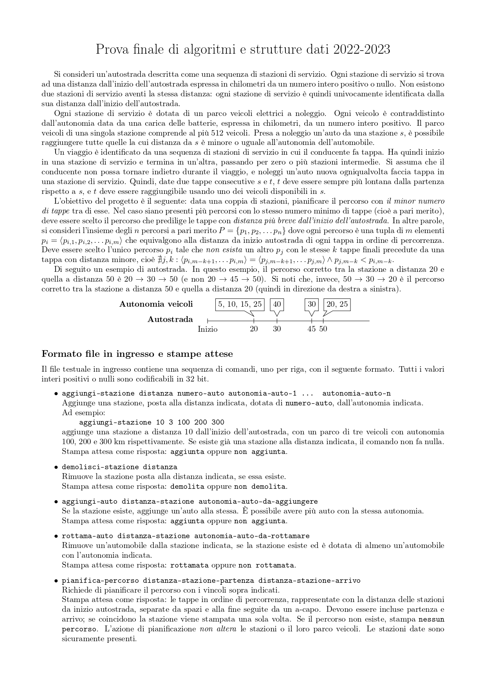

## Description

This project is about the final exam of the "Algoritmi e Principi dell'Informatica (API)" course at the Politecnico di Milano.

Here is the assignment:




## Features

- Red and Black Tree used to store the stations
- Efficient algorithm to find the right path
- Efficient use of memory

## Installation

To use the code in `project.c`, follow these steps:

1. Clone this repo
2. Compile `project.c` using 
```
$ gcc -DEVAL –Wall –Werror -std=gnu11 -O2 -pipe -static -s -o project
project.c -lm
```
3. Create a .txt test file to input the program (follow the instructions in the assignment sheet)

## Usage

To run the code in `project.c`, run the following command:

```
$ ./project <input_txt_file> <output_txt_file>
```
the program will print the correct result on the `<output>` file.


